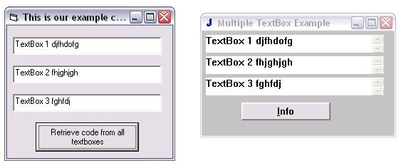



## \_A Supreme Window API Tutorial Part 2 \*\*\*\*

### Description

This continued version deals with the problem of "multiple textboxes (and other controls) on one window!" Yes, it can be troubling to try to retrieve info from one textbox and get data from another. Fear not, I know how to fix it. If you read my first tutorial, then you know about the FindWindowEx api, and how I claimed that "no one used the second hwnd parameter." Well, that parameter is actually how you access multiple controls on a window (I wasn't informed about it before, but I started c++ and now API is the only way to do things, so I am much more comfortable!). Check it out! KEYWORDS: FindWindow FindWindowEX findwindow findwindowex FINDWINDOW FINDWINDOWEX Multiple multiple Controls controls API api Api Continued continued Many MANY WINDOW window SendMessage SENDMESSAGE WM_GETTEXT Jaime Muscatelli
 
### More Info
 

             |
---                |---
**Submitted On**   |2002-02-28 00:08:20
**By**             |[Jaime Muscatelli](https://github.com/Planet-Source-Code/PSCIndex/blob/master/ByAuthor/jaime-muscatelli.md)
**Level**          |Intermediate
**User Rating**    |4.6 (46 globes from 10 users)
**Compatibility**  |VB 6\.0
**Category**       |[Windows API Call/ Explanation](https://github.com/Planet-Source-Code/PSCIndex/blob/master/ByCategory/windows-api-call-explanation__1-39.md)
**World**          |[Visual Basic](https://github.com/Planet-Source-Code/PSCIndex/blob/master/ByWorld/visual-basic.md)
**Archive File**   |[A\_Supreme\_1548602222003\.zip](https://github.com/Planet-Source-Code/jaime-muscatelli-a-supreme-window-api-tutorial-part-2__1-43375/archive/master.zip)

### Source Code

' *** IT IS HIGHLY RECOMMENDED THAT YOU READ MY FIRST WINDOW API TUTORIAL ON PSC FIRST! *** '
 
 
http://www.pscode.com/vb/scripts/ShowCode.asp?txtCodeId=42126&lngWId=1 
 
Anyway, the findwindowex API lookes something like this:
 FindWindowEx (ByVal hWnd1 As Long, ByVal hWnd2 As Long, ByVal lpsz1 As String, ByVal lpsz2 As String) As Long
Well, the first hwnd (window) parameter deals with the main window you are searching on, and THE SECOND deals with multiple
controls. How is that? Well, you would put the window handle of a previous control in that so it will conviently skip that control. In other
words, when you have the window handle of another control already, just include it in that so it would get the data from that control, but
rather the control you want it to.
I HAVE INCLUDED FILES (SOURCE EXAMPLES) with this tutorial, so download them please :-).
I included the source for a quick pure Win32 c++ app to use as an example, but I also included a vb example program (All you really need
is a program that has three textboxes on it, but vb has wierd class names like thunderedit and all that, where as c++ has the standard
"Edit" class name that we see in all other programs written in pure Win32 Languages (Like notepad etc). We will use this for an example.
This code will refer to that program, so you must have the downloaded and open when running our vb code!
Ok, my source is WELL commented, so just take it from there. I have included both the source to this and the c++ program.
'////////////////////////////
' DECLARE FindWindow,FindWindowEx, SendMessage, and then WM_GETTEXT
' Now, this should be pretty familiar to you (other than the second hwnd param).
' If it doesn't then you should download and read my first window tutorial on PSC
' It is named A Supreme Window Tutorial. (Just search for supreme)
' -- Jaime Muscatelli
' webmaster@jaimemuscatelli.zzn.com
 
Private Sub cmdretrieve_Click()
 
Dim lMainHwnd As Long
 
Dim lEdit1 As Long
 
Dim lEdit2 As Long
 
Dim lEdit3 As Long
 
'Yes, these are buffers/pointers. If you don't know what they are, then read my first tutorial
 
Dim sEdit1 As String * 256
 
Dim sEdit2 As String * 256
 
Dim sEdit3 As String * 256
 
lMainHwnd = FindWindow("MTBExample", "Multiple
TextBox Example")
 
'The Main window. Notice the custom class Name?!?! I Love C++
 
lEdit1 = FindWindowEx(lMainHwnd, 0&, "Edit", vbNullString)
 
' The first textbox. Nothing New here
 
lEdit2 = FindWindowEx(lMainHwnd, lEdit1, "Edit", vbNullString)
 
' Now this is where it gets interesting. See the second HWND param? It has the
' first textbox hwnd in it. Just like I said, include the first textbox hwnd
' so it will skip that window and go to the next window! :-)
 
lEdit3 = FindWindowEx(lMainHwnd, lEdit2, "Edit", vbNullString)
 
' Same process here, except we included the second textbox (Which has the first in it!)
' This is like a spider chart. The second includes the first, so the third will be found!
' Now this should be familiar (Again, if not, go to my first tutorial)
' It is just simple data retrieval
 
If lEdit3 Then
 
SendMessageString lEdit1, WM_GETTEXT, 256, sEdit1
 
SendMessageString lEdit2, WM_GETTEXT, 256, sEdit2
 
SendMessageString lEdit3, WM_GETTEXT, 256, sEdit3
 
txtEdit1.Text = sEdit1
 
txtEdit2.Text = sEdit2
 
txtEdit3.Text = sEdit3
 
MsgBox "All Done"
 
Else
 
MsgBox "It isn't finding the window, check and see if the program is running..."
 
End If
 
'/////////////////////////
If you have any further questions after DOWNLOADING and trying everything out, then email me at: webmaster@jaimemuscatelli.zzn.com . Please
vote for me, and check out my first tutorial and my other tutorials.
' If you are interested in learning c++, see my exclusive tutorial on PSC that is a vb to c++ tutorial. Just search for vb to c++ or something
(or go to the "All submissions by this author").

